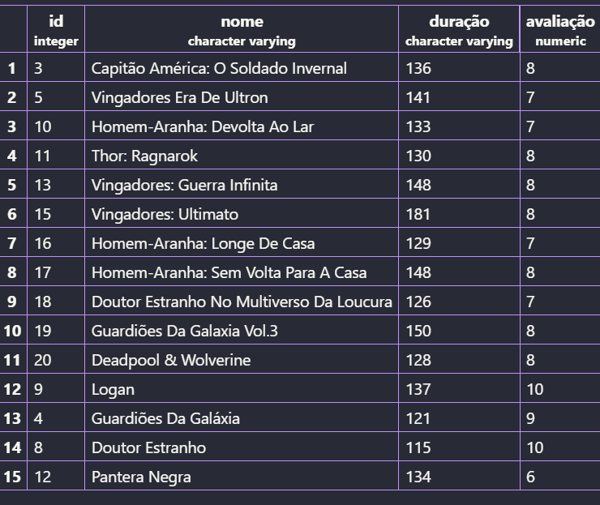

Para criar o banco de dados, ultilizamos o comando:
```sql
CREATE DATABASE filmes;
```

Para verificar os bancos de dados existentes:
```sql
\l
```

Agora, sairemos do postgres e reiniciamos ele com o codigo:
```sql
sudo systemctl restart postgresql
```

Agora abrimos o VScode e instalamos esta extensão:


Para fazer a conexão e executamos o seguinte comando:

ip do servidor; postgres; senha do postgres; 5432; standart connection; show all database; ip novamente. 

Agora clicamos no ip e em filmes para começar a criar nossas colunas.
Para criar a primeira tabela, usamos os comandos:

Para criar a primeira tabela, usamos os comandos:
```sql
CREATE TABLE filmes(
nome varchar(100) NOT NULL,
duração varchar(1000) NOT NULL,
avaliação numeric(10) NOT NULL DEFAULT 0
);
```
Para verificar as tabelas usamos o comando:
```sql
SELECT * FROM filmes
```
Para inserir dados na tabela, usamos o seguinte comando:
```sql
INSERT INTO filmes(nome,duração,avaliação)
VALUES('Homem de ferro','126','7,9');
```
Para verificar as tabelas usamos o comando:
```sql
SELECT * FROM filmes
```
Agora Vamos atualizar os dados se uma coluna usando o comando:
```sql
UPDATE movies SET avaliação = 10 WHERE id=9
```
Para ordenar por algum tópico da tabela usamos esse comando:
```sql
SELECT * FROM movies ORDER BY duração DESC;
```
Agora para apagar, usamos o comando:
```sql
DELETE FROM movies WHERE id=2;
```
Para verificar as tabelas usamos o comando:
```sql
SELECT * FROM filmes
```
No final a Minha tabela ficou assim:

