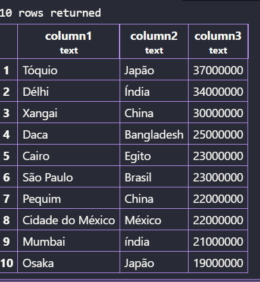

## Criando Nosso Primeiro Banco de Dados

Para acessar os bancos de dados no Moba, usamos o seguinte comando:
```bash
sudo -u postgres psql
```
---
Criando nosso Banco de dados no moba (usuario: postgres):

>Para criar o Banco de dados, usamos esse comando:
```sql
CREATE DATABASE cidades;
```


Para verificar os Bancos de dados existentes:
```sql
\l
```
Após isso, sairemos do postgres e reiniciamos ele com o codigo:
```sql
sudo systemctl restart postgresql
```
---
Agora abrimos o VScode e instalamos esta extensão:


Abrimos ela e clicamos no botão de + para fazer a conexão e executamos o seguinte comando:

>ip do servidor; postgresql; senha do postgres; 5432; standart connection; show all database.

---
Agora, faremos seguintes comandos:


> F5 para vizualizar a tabela.
---
**No final ficará assim:**



 


