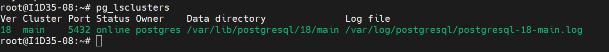
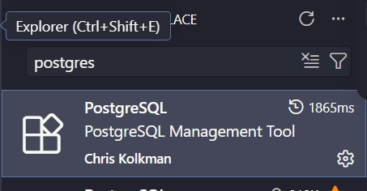

    ### Aula 02
Para verificar o status e demais informações do banco de dados, ultilizamos o comando:

```bash
pg_lsclusters
```



---

Para acesso, via root, sem senha (SOCKET LOCAL), ultilizamos o comando:

```bash
sudo -u postgres psql
```
>Com esse comando, não presciso mostrar quem meu usuario é, o Linux ja faz a autenticação.

> `\q` retorna ao usuario anterior (famoso \quit)

```sql
ALTER USER postgres PASSWORD '1234'
```
Apos a alteração da senha, iremos entrar no postgres com o seguinte comando:

```sql
sudo psql -h 127.0.0.1 -U postgres 
```


Configurações iniciais do POSTGRES:
-Para habilitar as conexões externas, de outros IPs, foi necessario as seguintes etapas:
1. Navegar ate a pasta do POSTGRESQL (`/etc/postgres/18/main/`);

2.Editar o arquivo `postgresql.conf` atraves do comando:

```bash
sudo nano postgresql.conf
```
3.Editar a linha listen_adresses = '*";

4.Editar o arquivo pg_hba.conf.

5.nas ultimas linhas adicionamos as seguintes configurações:

`host all all 0.0.0.0/24 scram-sha-256`
`host all all 10.87.47.0/24 scram-sha-256`

**Criação do primeiro banco de dados**


Para criar o banco de dados, ultilizamos o comando:
```sql
CREATE DATABASE cidades;
```

Para verificar os bancos de dados existentes:
```sql
\l
```

Agora, sairemos do postgres e reiniciamos ele com o codigo:
```sql
sudo systemctl restart postgresql
```

Agora abrimos o VScode e instalamos esta extensão:



Abrimos ela e clicamos no botão de + para fazer a conexão e executamos o seguinte comando:

ip do servidor; postgres; senha do postgres; 5432; standart connection; show all database; ip novamente. 

