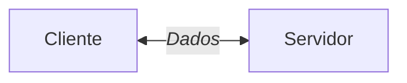
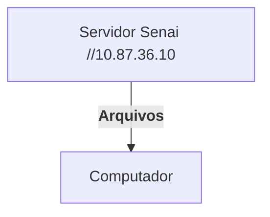
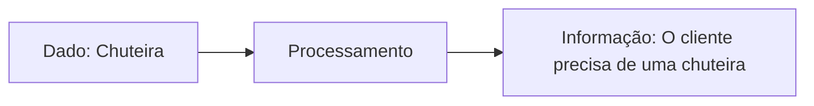
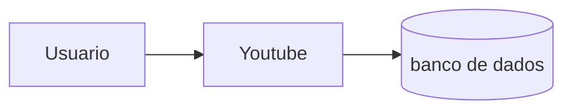

## Configuração do Servidor Educacional



---
**Objetivo**:
- Experiência real de mercado,
- Administração de recursos,
- Experiência em servidores Linux.

### Servidor de Arquivos 
Servidor educacional para arquivos, assim não dependendo da rede externa.


---
## Servidor de Desenvolvimento
Cada aluno recebe seu proprio acesso,
Cada maquina tem um IP diferente.

>192.168.10.18

|Recurso|Configuração|
|---|---|
|CPU|2 cores|
|RAM|512 MB|
|DISCO|6 GB|
|SISTEMA OPERACIONAL|Ubuntu 26.04|
|ACESSO|SSH (Secure Shell)|

Dados de acesso:
|Campo|valor|
|---|---|
|IP do Container|192.168.10.18|
|Usuário|Root|
|Senha Inicial|aluno01|

Comando para visualizar o uso de recursos:
```bash
htop
```
Comando para alterar a senha:
```bash
passwd
```
---

## Banco de Dados 
- *Dados*: informações isoladas que não dizem muita coisa exemplo: platini, futebol, chuteira 

- *Informação*: são dados estruturados exemplo: o Platini comprou uma chuteira para jogar futebol.

- *Conhecimento*: Oque podemos estrair conforme as informações 


---
#### O usuario faz uma requisição ao youtube que procura o resultado no banco de dados:

---
>Por qual razão, as empresas não salvam seus dados em arquivos comuns?

```mermaid
graph TD 
A[Guardar dados]-->B[Banco de dados]
 A[Guardar dados]-->C[Arquivos e planilhas]
 B-->B1[Varios usuarios ao mesmo tempo]
 B-->B2[Backup e Sincronização]
 B-->B3[Consultas rapidas e otimizadas]
 C-->C1[Um arquivo por vez]
 C-->C2[Backup ineficiente]
 ```
---

## SGBD
Sistema Gerenciador de Banco de Dados

>POSTGRESQL SGBD OpenSource e muito completo

Primeiro, começamos atualizando os pacotes
```bash
sudo apt update && upgrade
```

Para a instalação do Postgresql
```
sudo apt install -y postgresql


